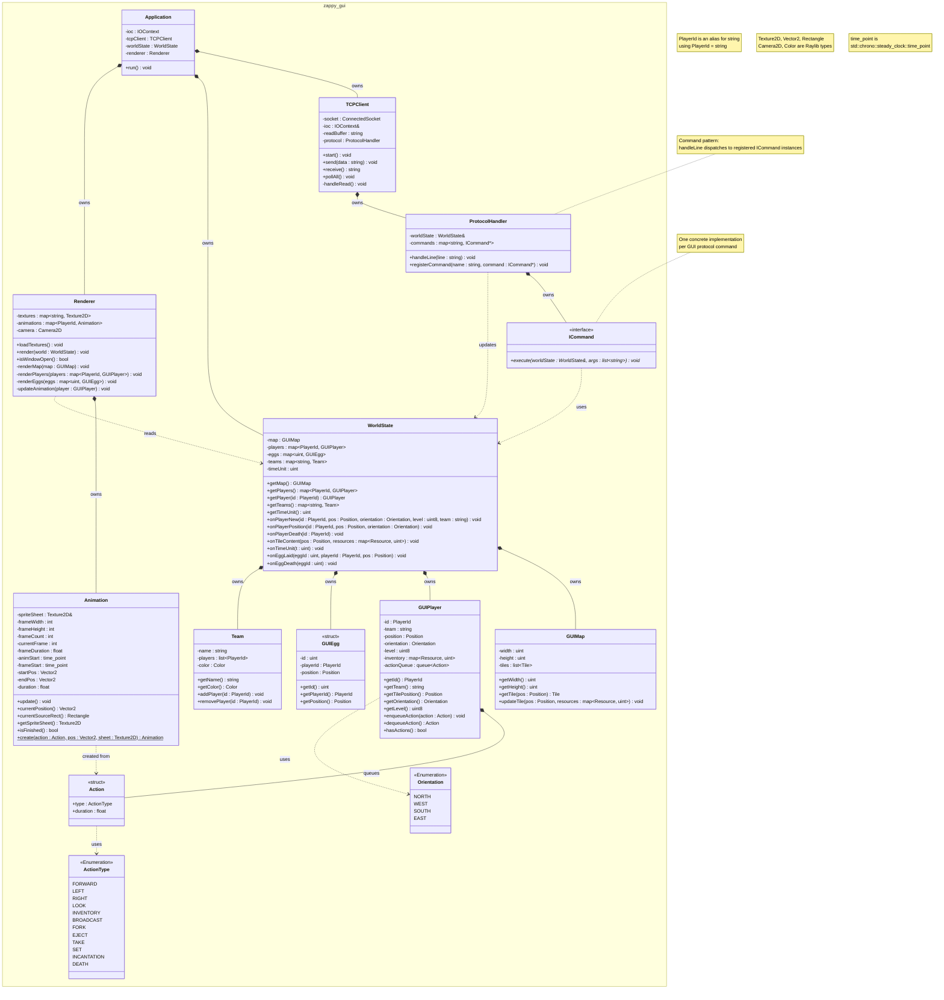

```mermaid
classDiagram
namespace zappy_gui {

  class ActionType {
    <<Enumeration>>
    FORWARD
    LEFT
    RIGHT
    LOOK
    INVENTORY
    BROADCAST
    FORK
    EJECT
    TAKE
    SET
    INCANTATION
    DEATH
  }

  class Orientation {
    <<Enumeration>>
    NORTH
    WEST
    SOUTH
    EAST
  }

  class Action {
    <<struct>>
    +type : ActionType
    +duration : float
  }

  class GUIPlayer {
    -id : PlayerId
    -team : string
    -position : Position
    -orientation : Orientation
    -level : uint8
    -inventory : map~Resource, uint~
    -actionQueue : queue~Action~
    +getId() PlayerId
    +getTeam() string
    +getTilePosition() Position
    +getOrientation() Orientation
    +getLevel() uint8
    +enqueueAction(action : Action) void
    +dequeueAction() Action
    +hasActions() bool
  }

  class GUIEgg {
    <<struct>>
    -id : uint
    -playerId : PlayerId
    -position : Position
    +getId() uint
    +getPlayerId() PlayerId
    +getPosition() Position
  }

  class Team {
    -name : string
    -players : list~PlayerId~
    -color : Color
    +getName() string
    +getColor() Color
    +addPlayer(id : PlayerId) void
    +removePlayer(id : PlayerId) void
  }

  class GUIMap {
    -width : uint
    -height : uint
    -tiles : list~Tile~
    +getWidth() uint
    +getHeight() uint
    +getTile(pos : Position) Tile
    +updateTile(pos : Position, resources : map~Resource, uint~) void
  }

  class WorldState {
    -map : GUIMap
    -players : map~PlayerId, GUIPlayer~
    -eggs : map~uint, GUIEgg~
    -teams : map~string, Team~
    -timeUnit : uint
    +getMap() GUIMap
    +getPlayers() map~PlayerId, GUIPlayer~
    +getPlayer(id : PlayerId) GUIPlayer
    +getTeams() map~string, Team~
    +getTimeUnit() uint
    +onPlayerNew(id : PlayerId, pos : Position, orientation : Orientation, level : uint8, team : string) void
    +onPlayerPosition(id : PlayerId, pos : Position, orientation : Orientation) void
    +onPlayerDeath(id : PlayerId) void
    +onTileContent(pos : Position, resources : map~Resource, uint~) void
    +onTimeUnit(t : uint) void
    +onEggLaid(eggId : uint, playerId : PlayerId, pos : Position) void
    +onEggDeath(eggId : uint) void
  }

  class ICommand {
    <<interface>>
    +execute(worldState : WorldState&, args : list~string~) void*
  }

  class ProtocolHandler {
    -worldState : WorldState&
    -commands : map~string, ICommand*~
    +handleLine(line : string) void
    +registerCommand(name : string, command : ICommand*) void
  }

  class TCPClient {
    -socket : ConnectedSocket
    -ioc : IOContext&
    -readBuffer : string
    -protocol : ProtocolHandler
    +start() void
    +send(data : string) void
    +receive() string
    +pollAll() void
    -handleRead() void
  }

  class Animation {
    -spriteSheet : Texture2D&
    -frameWidth : int
    -frameHeight : int
    -frameCount : int
    -currentFrame : int
    -frameDuration : float
    -animStart : time_point
    -frameStart : time_point
    -startPos : Vector2
    -endPos : Vector2
    -duration : float
    +update() void
    +currentPosition() Vector2
    +currentSourceRect() Rectangle
    +getSpriteSheet() Texture2D
    +isFinished() bool
    +create(action : Action, pos : Vector2, sheet : Texture2D) Animation$
  }

  class Renderer {
    -textures : map~string, Texture2D~
    -animations : map~PlayerId, Animation~
    -camera : Camera2D
    +loadTextures() void
    +render(world : WorldState) void
    +isWindowOpen() bool
    -renderMap(map : GUIMap) void
    -renderPlayers(players : map~PlayerId, GUIPlayer~) void
    -renderEggs(eggs : map~uint, GUIEgg~) void
    -updateAnimation(player : GUIPlayer) void
  }

  class Application {
    -ioc : IOContext
    -tcpClient : TCPClient
    -worldState : WorldState
    -renderer : Renderer
    +run() void
  }
}

note "PlayerId is an alias for string
using PlayerId = string"
note "Texture2D, Vector2, Rectangle
Camera2D, Color are Raylib types"
note "time_point is
std::chrono::steady_clock::time_point"
note for ProtocolHandler "Command pattern:
handleLine dispatches to registered ICommand instances"
note for ICommand "One concrete implementation
per GUI protocol command"

Application *-- TCPClient : owns
Application *-- WorldState : owns
Application *-- Renderer : owns
TCPClient *-- ProtocolHandler : owns
ProtocolHandler *-- ICommand : owns
ProtocolHandler ..> WorldState : updates
ICommand ..> WorldState : uses
WorldState *-- GUIMap : owns
WorldState *-- GUIPlayer : owns
WorldState *-- GUIEgg : owns
WorldState *-- Team : owns
GUIPlayer *-- Action : queues
GUIPlayer ..> Orientation : uses
Action ..> ActionType : uses
Renderer *-- Animation : owns
Renderer ..> WorldState : reads
Animation ..> Action : created from
```