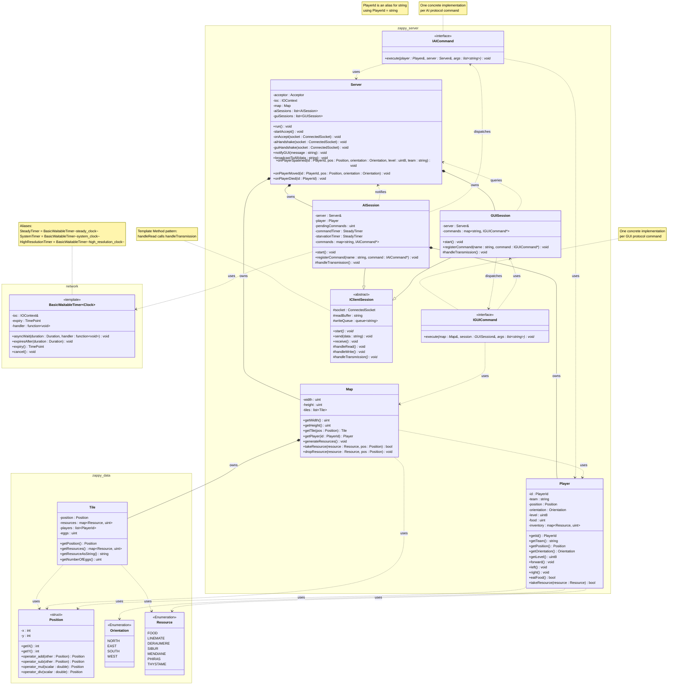

```mermaid
classDiagram
    namespace zappy_data {
        class Position {
            <<struct>>
            -x : int
            -y : int
            +getX() int
            +getY() int
            +operator_add(other : Position) Position
            +operator_sub(other : Position) Position
            +operator_mul(scalar : double) Position
            +operator_div(scalar : double) Position
        }

        class Orientation {
            <<Enumeration>>
            NORTH
            EAST
            SOUTH
            WEST
        }

        class Resource {
            <<Enumeration>>
            FOOD
            LINEMATE
            DERAUMERE
            SIBUR
            MENDIANE
            PHIRAS
            THYSTAME
        }

        class Tile {
            -position : Position
            -resources : map~Resource, uint~
            -players : list~PlayerId~
            -eggs : uint
            +getPosition() Position
            +getResources() map~Resource, uint~
            +getResourceAsString() string
            +getNumberOfEggs() uint
        }
    }

    namespace network {
        class BasicWaitableTimer~Clock~ {
            <<template>>
            -ioc : IOContext&
            -expiry : TimePoint
            -handler : function~void~
            +asyncWait(duration : Duration, handler : function~void~) void
            +expiresAfter(duration : Duration) void
            +expiry() TimePoint
            +cancel() void
        }
    }

    namespace zappy_server {

        class IAICommand {
            <<interface>>
            +execute(player : Player&, server : Server&, args : list~string~) void*
        }

        class IGUICommand {
            <<interface>>
            +execute(map : Map&, session : GUISession&, args : list~string~) void*
        }

        class IClientSession {
            <<abstract>>
            #socket : ConnectedSocket
            #readBuffer : string
            #writeQueue : queue~string~
            +start() void*
            +send(data : string) void
            +receive() void
            #handleRead() void
            #handleWrite() void
            #handleTransmission() void*
        }

        class AISession {
            -server : Server&
            -player : Player
            -pendingCommands : uint
            -commandTimer : SteadyTimer
            -starvationTimer : SteadyTimer
            -commands : map~string, IAICommand*~
            +start() void
            +registerCommand(name : string, command : IAICommand*) void
            #handleTransmission() void
        }

        class GUISession {
            -server : Server&
            -commands : map~string, IGUICommand*~
            +start() void
            +registerCommand(name : string, command : IGUICommand*) void
            #handleTransmission() void
        }

        class Server {
            -acceptor : Acceptor
            -ioc : IOContext
            -map : Map
            -aiSessions : list~AISession~
            -guiSessions : list~GUISession~
            +run() void
            -startAccept() void
            -onAccept(socket : ConnectedSocket) void
            -aiHandshake(socket : ConnectedSocket) void
            -guiHandshake(socket : ConnectedSocket) void
            +notifyGUI(message : string) void
            +broadcastToAll(data : string) void
            +onPlayerSpawned(id : PlayerId, pos : Position, orientation : Orientation, level : uint8, team : string) void
            +onPlayerMoved(id : PlayerId, pos : Position, orientation : Orientation) void
            +onPlayerDied(id : PlayerId) void
        }

        class Player {
            -id : PlayerId
            -team : string
            -position : Position
            -orientation : Orientation
            -level : uint8
            -food : uint
            -inventory : map~Resource, uint~
            +getId() PlayerId
            +getTeam() string
            +getPosition() Position
            +getOrientation() Orientation
            +getLevel() uint8
            +forward() void
            +left() void
            +right() void
            +eatFood() bool
            +takeResource(resource : Resource) bool
        }

        class Map {
            -width : uint
            -height : uint
            -tiles : list~Tile~
            +getWidth() uint
            +getHeight() uint
            +getTile(pos : Position) Tile
            +getPlayer(id : PlayerId) Player
            +generateResources() void
            +takeResource(resource : Resource, pos : Position) bool
            +dropResource(resource : Resource, pos : Position) void
        }
    }

    note "PlayerId is an alias for string
using PlayerId = string"
    note for BasicWaitableTimer "Aliases:
SteadyTimer = BasicWaitableTimer~steady_clock~
SystemTimer = BasicWaitableTimer~system_clock~
HighResolutionTimer = BasicWaitableTimer~high_resolution_clock~"
    note for IClientSession "Template Method pattern:
handleRead calls handleTransmission"
    note for IAICommand "One concrete implementation
per AI protocol command"
    note for IGUICommand "One concrete implementation
per GUI protocol command"

    AISession --|> IClientSession
    GUISession --|> IClientSession
    Server *-- AISession : owns
    Server *-- GUISession : owns
    Server *-- Map : owns
    AISession *-- Player : owns
    AISession ..> Server : notifies
    AISession ..> IAICommand : dispatches
    GUISession ..> Server : queries
    GUISession ..> IGUICommand : dispatches
    IAICommand ..> Player : uses
    IAICommand ..> Server : uses
    IGUICommand ..> Map : uses
    IGUICommand ..> GUISession : uses
    Map *-- Tile : owns
    Map ..> Player : uses
    Tile ..> Resource : uses
    Tile ..> Position : uses
    Map ..> Position : uses
    Player ..> Resource : uses
    Player ..> Position : uses
    Player ..> Orientation : uses
    AISession ..> BasicWaitableTimer : uses
```