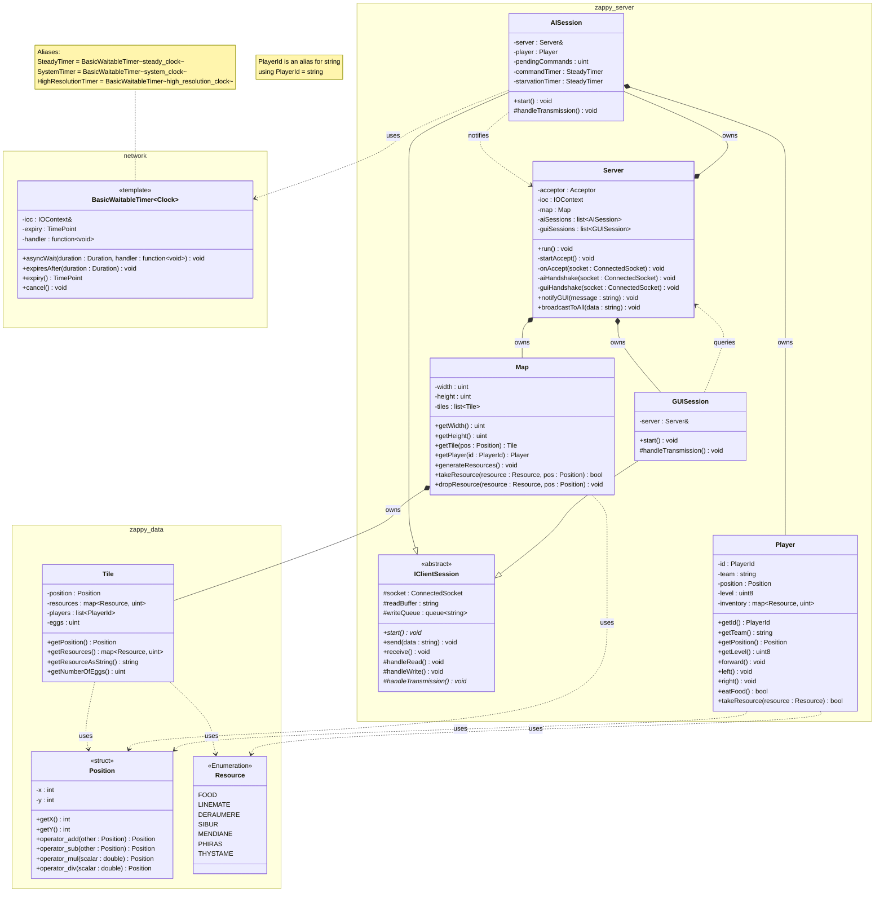

```mermaid
classDiagram
namespace zappy_data {
  class Position {
    <<struct>>
    -x : int
    -y : int
    +getX() int
    +getY() int
    +operator_add(other : Position) Position
    +operator_sub(other : Position) Position
    +operator_mul(scalar : double) Position
    +operator_div(scalar : double) Position
  }

  class Resource {
    <<Enumeration>>
    FOOD
    LINEMATE
    DERAUMERE
    SIBUR
    MENDIANE
    PHIRAS
    THYSTAME
  }

  class Tile {
    -position : Position
    -resources : map~Resource, uint~
    -players : list~PlayerId~
    -eggs : uint
    +getPosition() Position
    +getResources() map~Resource, uint~
    +getResourceAsString() string
    +getNumberOfEggs() uint
  }
}

namespace network {
  class BasicWaitableTimer~Clock~ {
    <<template>>
    -ioc : IOContext&
    -expiry : TimePoint
    -handler : function~void~
    +asyncWait(duration : Duration, handler : function~void~) void
    +expiresAfter(duration : Duration) void
    +expiry() TimePoint
    +cancel() void
  }
}

namespace zappy_server {
  class IClientSession {
    <<abstract>>
    #socket : ConnectedSocket
    #readBuffer : string
    #writeQueue : queue~string~
    +start() void*
    +send(data : string) void
    +receive() void
    #handleRead() void
    #handleWrite() void
    #handleTransmission() void*
  }

  class AISession {
    -server : Server&
    -player : Player
    -pendingCommands : uint
    -commandTimer : SteadyTimer
    -starvationTimer : SteadyTimer
    +start() void
    #handleTransmission() void
  }

  class GUISession {
    -server : Server&
    +start() void
    #handleTransmission() void
  }

  class Server {
    -acceptor : Acceptor
    -ioc : IOContext
    -map : Map
    -aiSessions : list~AISession~
    -guiSessions : list~GUISession~
    +run() void
    -startAccept() void
    -onAccept(socket : ConnectedSocket) void
    -aiHandshake(socket : ConnectedSocket) void
    -guiHandshake(socket : ConnectedSocket) void
    +notifyGUI(message : string) void
    +broadcastToAll(data : string) void
  }

  class Player {
    -id : PlayerId
    -team : string
    -position : Position
    -level : uint8
    -inventory : map~Resource, uint~
    +getId() PlayerId
    +getTeam() string
    +getPosition() Position
    +getLevel() uint8
    +forward() void
    +left() void
    +right() void
    +eatFood() bool
    +takeResource(resource : Resource) bool
  }

  class Map {
    -width : uint
    -height : uint
    -tiles : list~Tile~
    +getWidth() uint
    +getHeight() uint
    +getTile(pos : Position) Tile
    +getPlayer(id : PlayerId) Player
    +generateResources() void
    +takeResource(resource : Resource, pos : Position) bool
    +dropResource(resource : Resource, pos : Position) void
  }
}

note "PlayerId is an alias for string
using PlayerId = string"

note for BasicWaitableTimer "Aliases:
SteadyTimer = BasicWaitableTimer~steady_clock~
SystemTimer = BasicWaitableTimer~system_clock~
HighResolutionTimer = BasicWaitableTimer~high_resolution_clock~"

AISession --|> IClientSession
GUISession --|> IClientSession
Server *-- AISession : owns
Server *-- GUISession : owns
Server *-- Map : owns
AISession *-- Player : owns
AISession ..> Server : notifies
AISession ..> BasicWaitableTimer : uses
GUISession ..> Server : queries
Map *-- Tile : owns
Tile ..> Resource : uses
Tile ..> Position : uses
Map ..> Position : uses
Player ..> Resource : uses
Player ..> Position : uses
```
